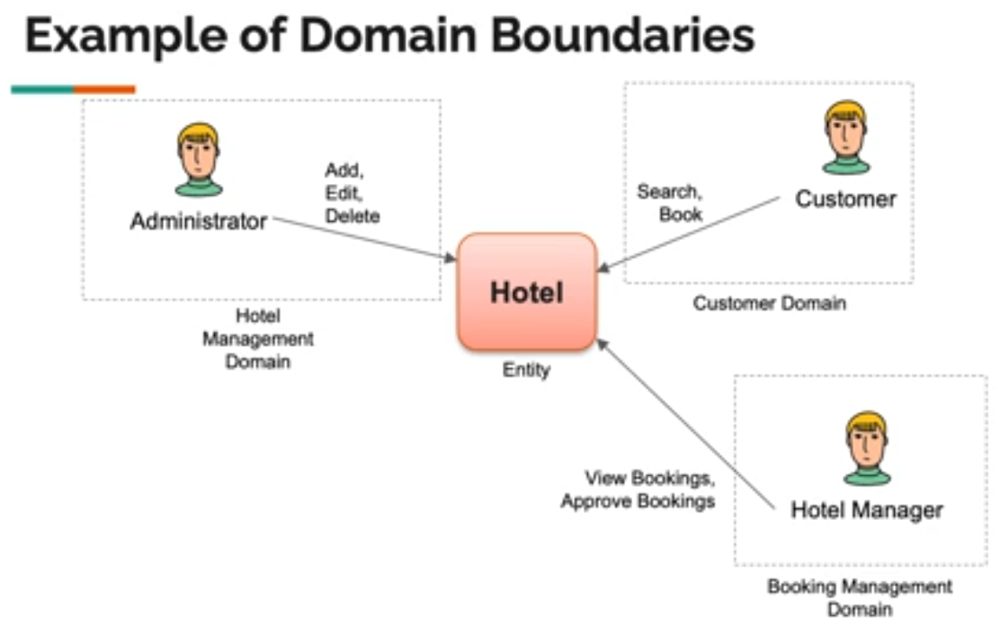
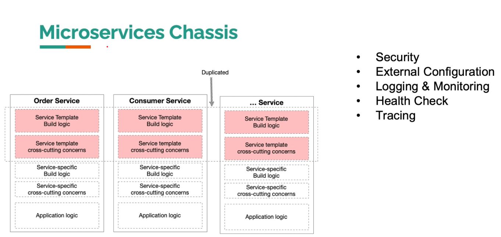
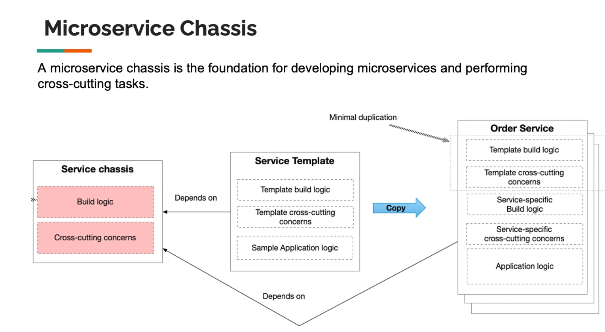
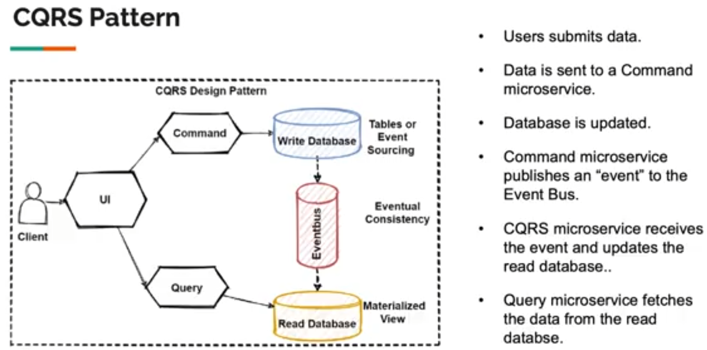
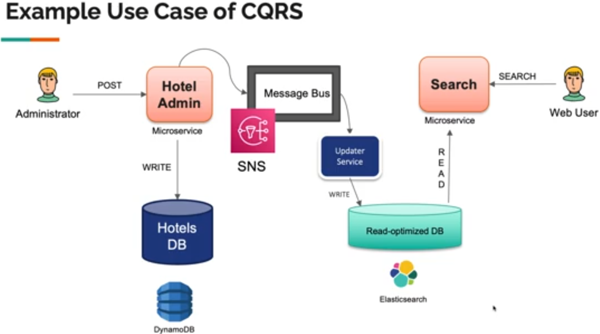
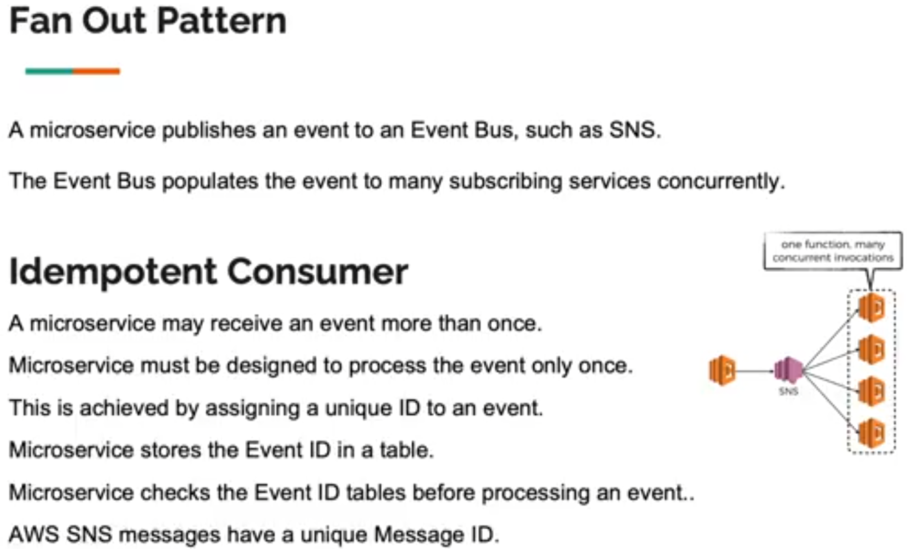
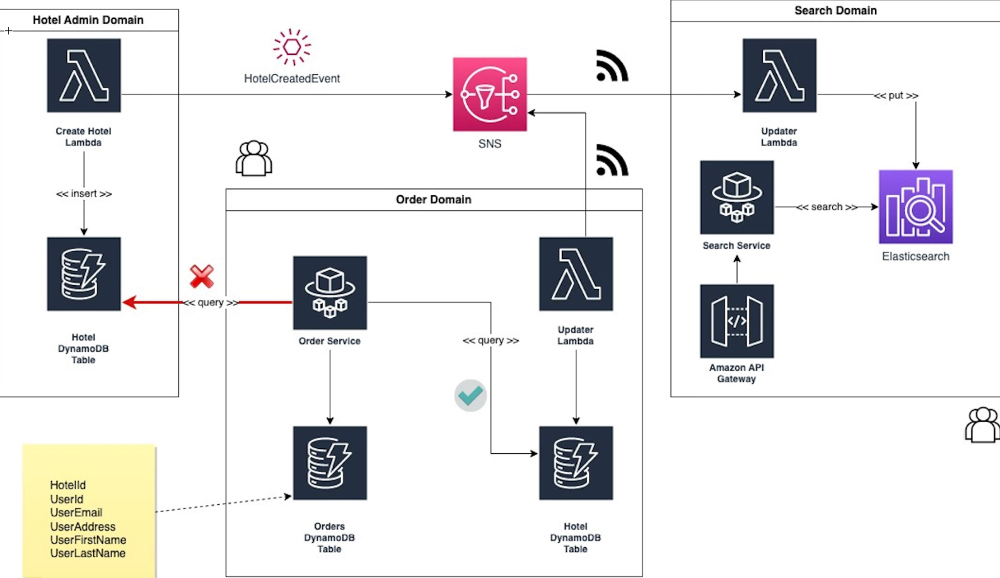

# BuildMicroservicesNETandAWS

## Overview

Event-Driven Microservices with Dotnet and AWS, Lambda, Docker, Kafka, RabbitMQ

[Udemy Course](https://www.udemy.com/course/build-microservices-with-aspnet-core-amazon-web-services/)

[Course Frontent Github Repo](https://github.com/aussiearef/MicroservicesWithAWS_FrontEnd)

Search this GitHub user's repositorys for all reps with name starting with: MicroservicesWithAWS

[AWS Permissions Repo](https://github.com/aussiearef/MicroservicesWithAWS)

## Install or update the AWS CLI

[Configure the AWS CLI](https://docs.aws.amazon.com/cli/latest/userguide/cli-chap-configure.html)

```powershell
# enter credentials in comman line:
aws configure

# AWS Access Key ID
# AWS Secret Access Key
# AWS Region (Default)

cd
cd .aws/

# view configuration / credentials
cat config
cat credentials

# edit credentials manually in file:
nano credentials
notepad credentials
```

## Add Tag Name to all AWS Resources for tracking purposes

Tag Name: Project
Tag Value: hotel-booking

### To list all resources that have a tag name of "Project" and value of "hotel-booking", you can use the AWS CLI list-tags-for-resource command

The AWS CLI command provides a simple way to list tags for a single resource. For listing resources across multiple services, AWS Resource Groups Tagging API or AWS Resource Explorer would be more suitable options.

1. Use the `list-tags-for-resource` command along with the `--resource-arn` flag to specify the ARN of the resource you want to get tags for.

```powershell
aws medialive list-tags-for-resource --resource-arn arn:aws:medialive:region:account-id:resource-id
```

2. The output will list all tags attached to the specified resource. You can then filter for the "Project" tag with value "hotel-booking".

### Use AWS Resource Explorer service in the AWS Management Console To list resources across multiple services with the specified tags

NOTE: Before you can search for the resources you must turn on and setup Resource Explorer. AWS Resource Explorer does not have any additional cost to use.

To list resources across multiple services with specified tags using AWS Resource Explorer:

1. Go to the AWS Resource Explorer console at [https://console.aws.amazon.com/resource-explorer](https://console.aws.amazon.com/resource-explorer)

2. On the navigation pane on the left, select "Views" and then click "Create view".

3. Give the view a name and select the AWS accounts and regions you want to include.

View Name: Project--hotel-booking

4. Under "Filters", click "Add filter" and select "Tag" as the filter type. Specify the key as "Project" and the value as "hotel-booking".

5. Click "Create view". This will create a view that includes resources from the selected accounts and regions that have the specified tag.

Filter: tag.key:Project tag.value:hotel-booking

6. On the navigation pane, select the view you just created. You will see a list of all resources across services like EC2, RDS, Lambda etc. that have the "Project" tag with value "hotel-booking".

7. You can also search for resources using the search bar at the top and specifying the tag as a search filter.

NOTE: To list resources across multiple services with the specified tags, you can use the AWS Resource Groups Tagging API or the AWS Resource Explorer service in the AWS Management Console

## Identity and Access Managemetn with AWS Cognito

### Create Pool

Create Cognito user pool

### Users

1. Admin - creates hotels (Admin group)
2. Hotel Manager (Manager group)
3. Customer - book hotels - normal users (Member group)

### Groups

1. Admin
2. Manager
3. Member

### Domain Boundaries of Hotel Entities

Hotel Entity has 3 Domain Boundaries:

1. Hotel Management Domain (Admin group)

- View List of Hotels
- Add Hotel
- Edit Hotel
- Delete Hotel

2. Booking Managment Domain (Manager group)

- View Bookings
- Approve Bookings

3. Customer Dommain (Member group)

- Search Hotels (may be separate microservice / lambda)
- Book Hotel (may include multiple microservices for: shopping cart, payment, loyalty, applying coupons)



## API Gateway

The API Gateway pattern is a design pattern in microservices architecture that provides a single entry point for different types of clients (like web, mobile, and others) to access the diverse microservices in the system.

Here are the key points about the API Gateway pattern:

Single Entry Point: It acts as a single point of entry into a system. This can simplify the client by moving the user-specific handling of the microservices into the API gateway.

Routing: It routes requests from clients to the appropriate microservice. The routing is based on the request type and the available resources.

Aggregation: It can aggregate responses from multiple microservices and return them to the client as a single response. This can reduce the number of requests between the client and the server.

Authentication and Authorization: It can handle authentication and authorization tasks, thus offloading these responsibilities from the microservices.

Rate Limiting and Caching: It can also handle rate limiting to prevent DoS attacks and can cache responses to improve performance.

Fault Isolation: It can isolate failures in the system, preventing them from cascading to other parts of the system.

Service Offloading: It can offload services like SSL termination, request object validation, response object validation, and other cross-cutting concerns.

In essence, the API Gateway pattern is a way to hide the underlying system's complexity from the client, providing a simpler interface for the client to interact with.

### AWS API Gateway

Create API Gateway

## HotelManagement Lambda

Create Microservice HotelManagement based on [Course Repository](https://github.com/aussiearef/MicroservicesWithAWS_Dotnet_HotelMan)





```powershell
mkdir HotelMagemementLambda
# create solution
dotnet new sln -n HotelManagement
# create HotelManagement classlib project
dotnet new classlib -o HotelManagement
# add project to solution
dotnet sln add HotelManagement

# install AWS Lambda Tools
dotnet tool install -g Amazon.Lambda.Tools
# update AWS Lambda Tools
dotnet tool update -g Amazon.Lambda.Tools

# Package Lamba from csproj file folder
dotnet lambda package --project-location ./HotelMagemementLambda/HotelManagement/ --configuration Release --framework net6.0 --output-package ./resources/releases/HotelManagement.zip
```

Add environment variable name: bucketName to lambda name: AddHotel to value to S3 bucket

### Create .NET 6.0 AddHotel Lambda

Upload Zip file
Edit Runtime Settings to:

- `AssemblyName::Namespace.ClassName::MethodName`
- HotelManagement::HotelManagement.HotelAdmin::FunctionHandler

## Storing Data and Files in AWS

S3

- Store Images

Dynamo DB

- Store Hotel Information

Create Role in IAM for Lambda to access (S3, Dynamo DB)

- Execution Role

Name: HotelAdminLambdaExecutionRole

Add Permissions:

- AmazonDynamoDB
- AWSLambdaBasicExecutionRole
- AWSLambdaExecute

Replace current Lambda Role with new role: HotelAdminLambdaExecutionRole

## Local Testing of Lambda

To test the HandlePost method locally, you can use a tool like Postman or curl to send a POST request to your local server. Here's a step-by-step guide on how to do this:

1. `Run your application locally`: You can use a tool like AWS SAM CLI or AWS .NET Mock Lambda Test Tool to run your Lambda function locally.
2. `Create a POST request`: Using a tool like Postman, you can create a POST request. The URL will be your localhost URL (for example, http://localhost:3000/) and the route you've defined for your HandlePost method.
3. `Set the headers`: In your POST request, set the Content-Type header to multipart/form-data.
4. `Set the body`: In the body of your POST request, you'll need to include the data you're testing with. In Postman, you can select the 'form-data' option and then input the key-value pairs for your data. Make sure to include a file in the 'file' key.
5. `Send the request`: Once you've set up your request, you can send it. Your local server should process the request and you'll be able to see the response in Postman.
   Remember to replace the AWS services (like `S3` and `DynamoDB`) with local alternatives or mock them for local testing. For example, you can use Amazon DynamoDB Local for testing DynamoDB operations locally.

There are several local alternatives to Amazon `S3` that you can use for testing purposes:

1. `MinIO`: MinIO is a high-performance, AWS S3 compatible object storage server designed for AI and ML workloads. It is API compatible with Amazon S3 cloud storage service. You can use MinIO to test your S3 operations locally. You can find more about it here.
2. `LocalStack`: LocalStack is a fully functional local AWS cloud stack that allows you to develop and test your cloud and Serverless apps offline. It provides an easy-to-use test/mocking framework for developing Cloud applications and includes support for S3. You can find more about it here.
3. `S3Ninja`: S3Ninja emulates the S3 API for development and testing purposes. It supports creating buckets, storing files, and serving them directly from a local server. You can find more about it here.
   Remember, these tools emulate the S3 API and are great for testing, but they may not have 100% feature parity with Amazon S3. Always test your application with the real Amazon S3 service before deploying to production.

[Setting up DynamoDB local (downloadable version)](https://docs.aws.amazon.com/amazondynamodb/latest/developerguide/DynamoDBLocal.html)

## CQRS Pattern





### Fan Out Pattern / Idempotent Consumer Pattern



## Create SNS

## Create OpenSearch Service (Elastic Search)

```bash
# QUERY from OpenSearch Dashboard > Dev Tools > Console
GET _search
{
  "query": {
    "match_all": {}
  }
}
DELETE /index_name
# DELETE

```

## Create DynamoDB table to store HotelCreatedEvent Message Ids

`This table will store eventIds that were processed by HotelCreatedEventHandler Lambda`

## Create HotelCreatedEventHandler Lambda

`This Lambda will:`

- Setup lambda to subscribe to SNS topic HotelCreatedEvent
- insert eventId from topic into dynamodb
- insert message from topic into opensearch

## Create HotelSearchApi Microservice

`This microservice provides an endpoint for customer to search OpenSearch for hotels`

## Create HotelSearch Lambda

`This Lambda will allow Customers in (Cognito Member group) to search DynamoDB table [HotelsCache] for hotels`

## Creating and Querying Global Secondary Index (GSI) in Amazon DynamoDB

### Create Global Secondary Index (GSI) in Amazon DynamoDB

### Query a DynamoDB table using a Global Secondary Index (GSI)

## Book Hotel

`This functionality will allow Customers in (Cognito Member group) to book hotel`



