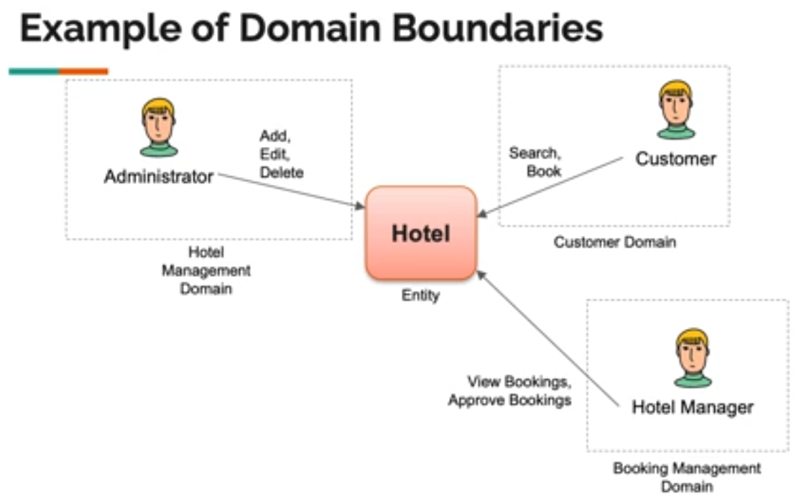

# Hotel Booking Application

## Create React App using Vite

[Documentation](https://vitejs.dev/guide/)

```powershell

npm create vite@latest

√ Project name: ... client
√ Select a framework: » React
√ Select a variant: » TypeScript + SWC

Done. Now run:

  cd client
  npm install
  npm run start
```

## Packages

- Material UI: v4 - import {Container} from "@mui/material"
- Axios
- Redux
- Forms (React-hook-form)
- React-Router - version????

### Material UI

[Documentation](https://mui.com/material-ui/)

```powershell
npm install @mui/material @emotion/react @emotion/styled

npm install @fontsource/roboto

npm install @mui/icons-material @mui/lab

```

### React Router

[Documentation React Router v6+](https://reactrouter.com/en/main/start/overview)

```powershell
npm i react-router-dom
```

### Axios

HTTP Client

```powershell
npm install axios
```

### react-toastify

[NPM](https://www.npmjs.com/package/react-toastify)
[Playground](https://fkhadra.github.io/react-toastify/introduction/)
[Using React-Toastify to style your toast messages](https://blog.logrocket.com/using-react-toastify-style-toast-messages/)

```powershell
npm i react-toastify
```

### React Hook Form

[Documentation](https://react-hook-form.com/)

[useForm API](https://react-hook-form.com/docs/useform)

```powershell
npm i react-hook-form
```

### Drop Zone component

There are a few options to choose from but you'll need to confirm they work with installed versions of Material UI and React Hook Form.

Per the course instructions, we're installing react-dropzone:

```powershell
npm i react-dropzone
```

## Cognito

```powershell
npm i amazon-cognito-identity-js aws-sdk
npm install --save-dev @types/node
```

### Examples of signIn, signOut, signUp, etc...

[Examples](https://www.npmjs.com/package/amazon-cognito-identity-js)

[Article](https://www.sammeechward.com/cognito-user-pool-react)

```tsx
// Sign in
const signIn = (username: string, password: string) => {
  const authenticationDetails = new AuthenticationDetails({
    Username: username,
    Password: password,
  });

  const cognitoUser = new CognitoUser({
    Username: username,
    Pool: userPool,
  });

  cognitoUser.authenticateUser(authenticationDetails, {
    onSuccess: function (result) {
      console.log('access token + ' + result.getAccessToken().getJwtToken());
      // You can use the CognitoUserSession object to get and refresh tokens.
      // result.getIdToken().getJwtToken()
    },
    onFailure: function (err) {
      console.error(err);
    },
  });
};

// Sign out
const signOut = () => {
  const cognitoUser = userPool.getCurrentUser();

  if (cognitoUser != null) {
    cognitoUser.signOut();
  }
};

// Sign up
const signUp = (
  username: string,
  password: string,
  email: string,
  givenName: string,
  familyName: string,
  address: string,
  billingAddress: string | null = null
) => {
  const attributeList = [
    new CognitoUserAttribute({
      Name: 'email',
      Value: email,
    }),
    new CognitoUserAttribute({
      Name: 'given_name',
      Value: givenName,
    }),
    new CognitoUserAttribute({
      Name: 'family_name',
      Value: familyName,
    }),
    new CognitoUserAttribute({
      Name: 'address',
      Value: address,
    }),
    // Add any other attributes you want to set
  ];

  if (billingAddress) {
    attributeList.push(
      new CognitoUserAttribute({
        Name: 'custom:billing_address',
        Value: billingAddress,
      })
    );
  }

  userPool.signUp(username, password, attributeList, [], (err, result) => {
    if (err) {
      console.error(err);
      return;
    }
    if (result) {
      console.log('user name is ' + result.user.getUsername());
    } else {
      console.error('No result returned');
    }
  });
};
```

[Cognito Integrate App](https://docs.aws.amazon.com/cognito/latest/developerguide/cognito-integrate-apps.html)

[Amplify Dev Center / Getting Started](https://ui.docs.amplify.aws/react/getting-started/installation)

## Domain Boundaries of Hotel Entity

Hotel Entity has 3 Domain Boundaries:

- Hotel Management Domain

  - View List of Hotels
  - Add Hotel
  - Edit Hotel
  - Delete Hotel

- Booking Managment Domain

  - View Bookings
  - Approve Bookings

- Customer Dommain

  - Search Hotels (may be separate microservice)
  - Book Hotel (may include multiple microservices for: shopping cart, payment, loyalty, applying coupons)


